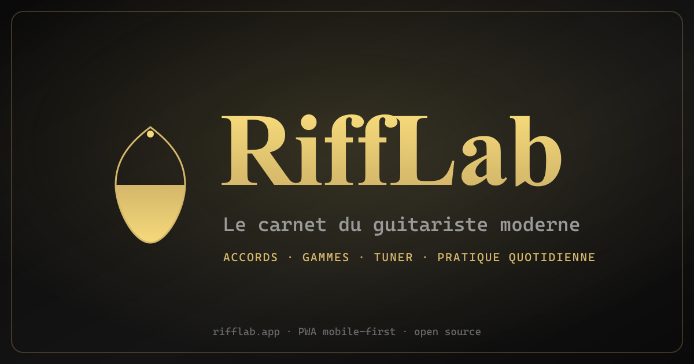
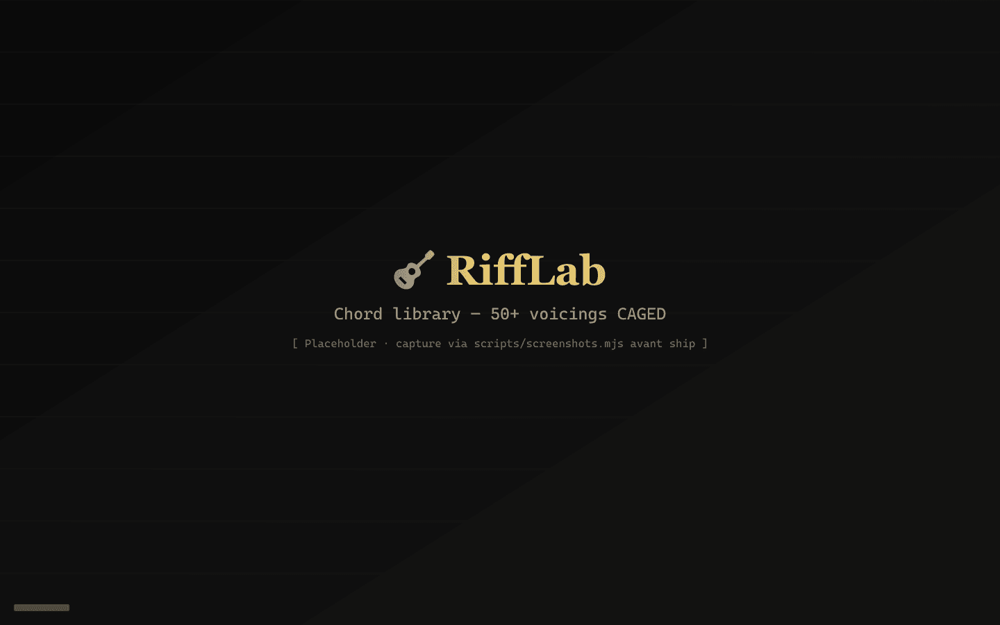
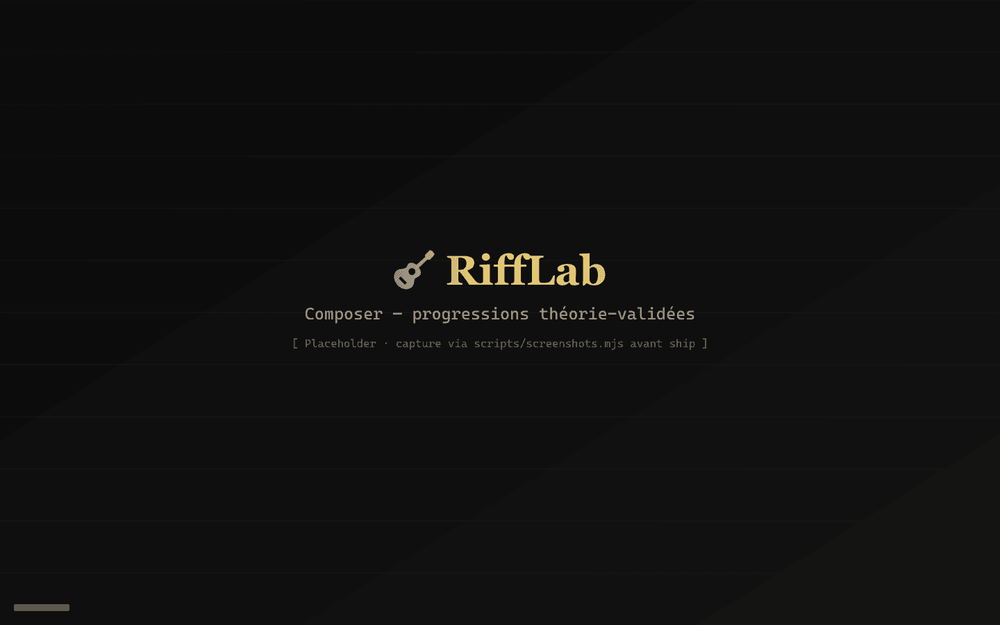

<div align="center">
  

  # 🎸 RiffLab

  **Le carnet du guitariste moderne.**
  Pratique quotidienne · sons · accords · gammes · riffs.
  Sans pub. Sans inscription forcée. Local-first.

  [**Lancer l'app →**](https://riff-lab-sigma.vercel.app)
  &nbsp;·&nbsp;
  [À propos](https://riff-lab-sigma.vercel.app/about)
  &nbsp;·&nbsp;
  [Roadmap](docs/ROADMAP.md)
</div>

---

## Pourquoi RiffLab ?

J'en avais marre d'Ultimate Guitar bourré de pubs, des apps freemium qui te bloquent les tablatures derrière un paywall, et des sites qui veulent ton email avant de t'afficher un Em.

RiffLab c'est l'app que j'aurais aimé avoir quand j'ai commencé la gratte : un carnet personnel propre, qui marche sur mon téléphone posé sur le pupitre en répèt, qui me garde **un seul endroit** pour mes morceaux, mes accords, mes idées de riffs, et qui m'apprend la théorie quand j'en ai besoin.

100% navigateur. Pas d'install obligatoire (mais possible en PWA). Pas de tracking. Tes données restent chez toi tant que tu n'actives pas la sync cloud.

---

## Ce que tu peux faire

- 🎵 **Tes morceaux** — note tes covers / compos avec accords, paroles, sections, audio enregistré perso
- 🎼 **Composer** — générateur de progressions théorie-validées (clé, style, swap intelligents)
- 🎸 **Bibliothèque d'accords** — 50+ accords avec voicings CAGED, diagrammes propres, son réaliste
- 🎹 **Gammes & modes** — visualiseur fretboard SVG, 11 gammes, intervals colorisés
- 📅 **Plan de pratique Duolingo-like** — chemin progressif, streak quotidien, mini-quiz par niveau
- 🎯 **Daily challenge** — un défi par jour, basé sur ton niveau
- 📊 **Stats** — heatmap calendaire, top accords/gammes, courbe 30 jours
- 🎤 **Setlists** — groupe tes morceaux, exporte un chord chart PDF imprimable A4
- 🎙 **Recordings** — enregistre tes essais via micro, garde-les rangés par morceau
- 🌊 **Riff of the week** — un riff découverte chaque semaine
- 🎚 **Tuner** + **Métronome** intégrés (YIN pitch detection)
- 🌐 **PWA installable**, offline-first, mobile-first absolu

---

## Screenshots

> Captures haute résolution dans [`public/screenshots/`](public/screenshots) (à venir).
> En attendant, l'app est live : [riff-lab-sigma.vercel.app](https://riff-lab-sigma.vercel.app)

| | |
|---|---|
|  |  |
| **Landing** — hero 3D + pitch | **Dashboard** — daily challenge + streak |
|  |  |
| **Bibliothèque d'accords** — 50+ voicings | **Composer** — progressions générées |

---

## Stack tech (pour les curieux)

- **Vite + React 18 + TypeScript** (strict)
- **Tailwind CSS 3** — design system tokens (or chaud `#d4b76a` + noir profond `#0a0a0a`)
- **React Router v6** + **Zustand** (persisted)
- **Framer Motion** pour les transitions
- **Dexie.js** — IndexedDB local-first (songs / setlists / recordings / sessions)
- **Tone.js** + **WebAudioFont GM presets** — moteur audio sampled realistic
- **Three.js + R3F + drei** — décoratif uniquement (hero landing, ambient, toggle 3D scales)
- **Supabase** — auth magic-link + Google OAuth (sync cloud à venir)
- **react-i18next** — FR / EN
- **vite-plugin-pwa + Workbox** — install + offline
- **jsPDF** — export setlist chord chart imprimable

Architecture détaillée : [`CLAUDE.md`](CLAUDE.md) et [`docs/ROADMAP.md`](docs/ROADMAP.md).

---

## Démarrage

```bash
npm install
npm run dev          # → http://localhost:5173
npm run build        # tsc + vite build
npm run preview      # tester le build local
npm run lint         # eslint
npm run format       # prettier
```

Pour activer la sync cloud / l'auth en local, créer `.env.local` à partir de `.env.example` :

```bash
VITE_SUPABASE_URL=https://<your-project>.supabase.co
VITE_SUPABASE_ANON_KEY=<your-anon-key>
```

Sans ces variables, l'app marche en mode 100% local (pas de bouton "Se connecter").

---

## Roadmap publique

- ✅ **Phase 1–4 livrées** — MVP utilisable + polish + Three.js décoratif + 5 thèmes
- ✅ **Phase 5.1 Auth** — Supabase magic-link + Google OAuth
- 🟠 **Phase 5.2 Sync cloud** — bidirectionnel Dexie ↔ Postgres (spec : [`docs/architecture/PHASE-5.2-SYNC-CLOUD.md`](docs/architecture/PHASE-5.2-SYNC-CLOUD.md))
- ⏳ **Phase 5.3 AI** — assistant compo, theory hints, génération progressions avancée
- ⏳ **Phase 5.4 Monétisation** — tier Free/Pro Stripe, cosmetics shop
- ⏳ **Phase 6 Chrome extension** — capture YouTube tutos en 1 clic (spec : [`docs/architecture/PHASE-6-CHROME-EXTENSION.md`](docs/architecture/PHASE-6-CHROME-EXTENSION.md))
- 🌠 **Phase 7+ Moonshots** — marketplace, mode AR caméra+manche, voice command

Détail complet : [`docs/ROADMAP.md`](docs/ROADMAP.md).

---

## Promesses

- 🚫 **Pas de pub.** Jamais.
- 🚫 **Pas de tracking.** Aucun analytics tiers, aucun pixel Meta/Google, aucune télémétrie cachée.
- 🚫 **Pas de paywall sur les features de base.** L'app reste utilisable à 100% sans payer.
- 🚫 **Pas de vente de données.** Tes morceaux sont à toi.
- ✅ **Local-first.** Tu peux utiliser RiffLab offline, sans compte. Le cloud est opt-in.

---

## Feedback / contribuer

- 🐛 **Bug ou idée** → bouton flottant 💬 dans l'app (envoie sur Discord webhook) ou [issue GitHub](https://github.com/Azraude/RiffLab/issues)
- 💌 **Contact** → melvin.bruhat[at]gmail.com
- 🎸 **Discord guitaristes** → bientôt

---

## License

MIT pour le code. Les samples audio (WebAudioFont GM presets) sont sous leurs licences respectives.

---

<div align="center">
  <sub>Construit par <a href="https://github.com/Azraude">Melvin</a> · guitariste autodidacte · à Paris ☕</sub>
</div>
